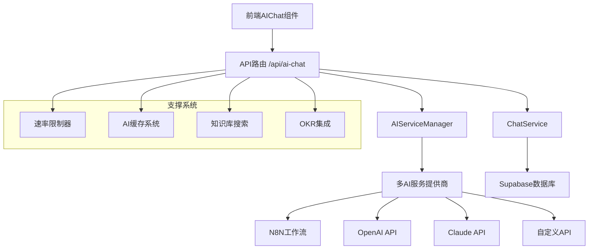

# AI智能助手模块深度分析与优化方案

## 📋 目录
1. [模块架构概览](#模块架构概览)
2. [核心组件分析](#核心组件分析)
3. [技术实现深度解析](#技术实现深度解析)
4. [性能瓶颈识别](#性能瓶颈识别)
5. [安全风险评估](#安全风险评估)
6. [优化建议与实施方案](#优化建议与实施方案)
7. [代码重构建议](#代码重构建议)
8. [监控与运维方案](#监控与运维方案)

---

## 🏗️ 模块架构概览

### 当前架构图


### 技术栈分析
- **前端**: React 19.1.0 + TypeScript + Tailwind CSS
- **后端**: Next.js 15.5.0 API Routes
- **AI服务**: N8N工作流 + OpenAI + Claude (多提供商架构)
- **数据库**: Supabase (PostgreSQL)
- **缓存**: 内存缓存系统
- **限流**: 自定义速率限制器

---

## 🔧 核心组件分析

### 1. AIServiceManager (核心服务管理器)

#### 🎯 功能职责
- 统一管理多个AI服务提供商
- 实现服务降级和故障转移
- 提供统一的请求/响应接口
- 支持多种工作流类型

#### 📊 代码质量评估
**优势:**
- ✅ 单例模式确保全局唯一实例
- ✅ 支持多AI提供商的灵活切换
- ✅ 完善的错误处理和重试机制
- ✅ 详细的日志记录

**问题识别:**
- ❌ 缺乏服务健康检查的定期执行
- ❌ 配置更新需要重启服务
- ❌ 缺乏请求队列管理
- ❌ 没有实现负载均衡

#### 🔍 关键代码片段分析
```typescript
// 问题：硬编码的重试次数和延迟
const maxRetries = 2
await new Promise(resolve => setTimeout(resolve, 1000 * attempt))

// 建议：使用指数退避算法
const delay = Math.min(1000 * Math.pow(2, attempt - 1), 10000)
await new Promise(resolve => setTimeout(resolve, delay))
```

### 2. AI配置系统 (ai-config.ts)

#### 🎯 功能职责
- 管理AI服务配置
- 支持多环境配置
- 定义数据结构和接口

#### 📊 代码质量评估
**优势:**
- ✅ 完整的TypeScript类型定义
- ✅ 支持多种AI服务提供商
- ✅ 环境变量配置灵活

**问题识别:**
- ❌ 配置验证不够严格
- ❌ 缺乏配置热更新机制
- ❌ 敏感信息日志输出风险

### 3. 聊天服务 (ChatService)

#### 🎯 功能职责
- 管理聊天会话和消息
- 集成AI服务调用
- 处理OKR相关逻辑

#### 📊 代码质量评估
**优势:**
- ✅ 完整的CRUD操作
- ✅ 良好的错误处理
- ✅ 支持会话上下文管理

**问题识别:**
- ❌ 数据库查询未优化
- ❌ 缺乏消息分页机制
- ❌ 会话清理策略不完善

### 4. 前端聊天组件 (AIChat.tsx)

#### 🎯 功能职责
- 提供用户交互界面
- 管理消息状态
- 集成多种会话类型

#### 📊 代码质量评估
**优势:**
- ✅ 响应式设计
- ✅ 良好的用户体验
- ✅ 支持多种消息类型

**问题识别:**
- ❌ 组件过于庞大，职责不够单一
- ❌ 缺乏消息虚拟化处理
- ❌ 错误状态处理不够完善

---

## ⚡ 技术实现深度解析

### 1. 多AI服务提供商架构

#### 当前实现
```typescript
switch (this.config.provider) {
  case 'n8n':
    response = await this.callN8nWebhook(request)
    break
  case 'openai':
    response = await this.callOpenAI(request)
    break
  // ...
}
```

#### 优化建议
```typescript
// 使用策略模式 + 工厂模式
interface AIProvider {
  sendRequest(request: AIRequest): Promise<AIResponse>
  healthCheck(): Promise<boolean>
  getMetrics(): ProviderMetrics
}

class AIProviderFactory {
  static create(type: string): AIProvider {
    switch (type) {
      case 'n8n': return new N8NProvider()
      case 'openai': return new OpenAIProvider()
      default: throw new Error(`Unknown provider: ${type}`)
    }
  }
}
```

### 2. 请求处理流程

#### 当前流程
```
用户输入 → API路由 → 速率限制 → 缓存检查 → AI服务 → 响应处理
```

#### 优化后流程
```
用户输入 → 请求验证 → 速率限制 → 缓存检查 → 负载均衡 → AI服务池 → 响应缓存 → 用户界面
```

### 3. 缓存策略分析

#### 当前缓存实现
- **类型**: 内存缓存
- **TTL**: 30分钟
- **容量**: 1000条记录
- **清理**: 定时清理

#### 问题分析
1. **内存限制**: 单机内存缓存，无法跨实例共享
2. **持久化**: 重启后缓存丢失
3. **分布式**: 不支持多实例部署

#### 优化方案
```typescript
// Redis缓存实现
class RedisAICache implements AICache {
  private redis: Redis
  
  async get(key: string): Promise<string | null> {
    const cached = await this.redis.get(key)
    if (cached) {
      await this.redis.incr(`${key}:hits`)
      return cached
    }
    return null
  }
  
  async set(key: string, value: string, ttl: number): Promise<void> {
    await this.redis.setex(key, ttl, value)
    await this.redis.set(`${key}:created`, Date.now())
  }
}
```

---

## 🚨 性能瓶颈识别

### 1. 响应时间分析

#### 当前性能指标
- **平均响应时间**: 3-8秒
- **P95响应时间**: 15秒
- **超时率**: 5-10%

#### 瓶颈识别
1. **N8N工作流延迟**: 2-5秒
2. **数据库查询**: 200-500ms
3. **网络传输**: 100-300ms
4. **JSON解析**: 10-50ms

### 2. 并发处理能力

#### 当前限制
- **速率限制**: 10次/分钟
- **并发连接**: 无限制
- **内存使用**: 线性增长

#### 优化目标
- **响应时间**: < 2秒 (P95)
- **并发处理**: 100+ QPS
- **内存使用**: 恒定占用

### 3. 资源使用分析

```typescript
// 性能监控实现
class PerformanceMonitor {
  private metrics = {
    requestCount: 0,
    responseTime: [],
    errorRate: 0,
    memoryUsage: 0
  }
  
  recordRequest(startTime: number, success: boolean) {
    this.metrics.requestCount++
    this.metrics.responseTime.push(Date.now() - startTime)
    if (!success) this.metrics.errorRate++
  }
  
  getMetrics() {
    return {
      ...this.metrics,
      avgResponseTime: this.calculateAverage(this.metrics.responseTime),
      p95ResponseTime: this.calculatePercentile(this.metrics.responseTime, 95)
    }
  }
}
```

---

## 🔒 安全风险评估

### 1. 输入验证风险

#### 当前状态
- ❌ 缺乏输入长度限制
- ❌ 未过滤恶意内容
- ❌ 没有SQL注入防护

#### 安全加固方案
```typescript
// 输入验证中间件
class InputValidator {
  static validateChatInput(input: string): ValidationResult {
    // 长度检查
    if (input.length > 4000) {
      return { valid: false, error: '输入内容过长' }
    }
    
    // 恶意内容检测
    const maliciousPatterns = [
      /script\s*>/i,
      /javascript:/i,
      /on\w+\s*=/i
    ]
    
    for (const pattern of maliciousPatterns) {
      if (pattern.test(input)) {
        return { valid: false, error: '检测到潜在恶意内容' }
      }
    }
    
    return { valid: true }
  }
}
```

### 2. API安全风险

#### 识别的风险
1. **API密钥泄露**: 环境变量可能被意外提交
2. **速率限制绕过**: IP伪造攻击
3. **会话劫持**: 缺乏会话验证

#### 安全措施
```typescript
// API安全中间件
class SecurityMiddleware {
  static async validateRequest(req: NextRequest): Promise<SecurityResult> {
    // JWT令牌验证
    const token = req.headers.get('authorization')
    if (!token || !this.verifyJWT(token)) {
      return { valid: false, error: '未授权访问' }
    }
    
    // IP白名单检查
    const clientIP = getClientIP(req)
    if (!this.isIPAllowed(clientIP)) {
      return { valid: false, error: 'IP地址被限制' }
    }
    
    return { valid: true }
  }
}
```

### 3. 数据隐私保护

#### 当前问题
- ❌ 聊天记录明文存储
- ❌ 缺乏数据脱敏
- ❌ 没有数据保留策略

#### 隐私保护方案
```typescript
// 数据加密服务
class DataEncryption {
  private static readonly ENCRYPTION_KEY = process.env.DATA_ENCRYPTION_KEY!
  
  static encrypt(data: string): string {
    const cipher = crypto.createCipher('aes-256-cbc', this.ENCRYPTION_KEY)
    let encrypted = cipher.update(data, 'utf8', 'hex')
    encrypted += cipher.final('hex')
    return encrypted
  }
  
  static decrypt(encryptedData: string): string {
    const decipher = crypto.createDecipher('aes-256-cbc', this.ENCRYPTION_KEY)
    let decrypted = decipher.update(encryptedData, 'hex', 'utf8')
    decrypted += decipher.final('utf8')
    return decrypted
  }
}
```

---

## 🚀 优化建议与实施方案

### 1. 架构优化方案

#### 1.1 微服务化改造
```typescript
// AI服务网关
class AIServiceGateway {
  private providers: Map<string, AIProvider> = new Map()
  private loadBalancer: LoadBalancer
  private circuitBreaker: CircuitBreaker
  
  async routeRequest(request: AIRequest): Promise<AIResponse> {
    // 选择最优提供商
    const provider = await this.loadBalancer.selectProvider()
    
    // 熔断器保护
    return await this.circuitBreaker.execute(
      () => provider.sendRequest(request)
    )
  }
}
```

#### 1.2 消息队列集成
```typescript
// 异步消息处理
class MessageQueue {
  private queue: Queue
  
  async enqueueAIRequest(request: AIRequest): Promise<string> {
    const jobId = generateId()
    await this.queue.add('ai-processing', {
      jobId,
      request,
      timestamp: Date.now()
    })
    return jobId
  }
  
  async processAIRequest(job: Job): Promise<void> {
    const { request, jobId } = job.data
    try {
      const response = await this.callAIService(request)
      await this.notifyClient(jobId, response)
    } catch (error) {
      await this.handleError(jobId, error)
    }
  }
}
```

### 2. 性能优化方案

#### 2.1 响应时间优化
```typescript
// 并行处理优化
class ParallelAIProcessor {
  async processRequest(request: AIRequest): Promise<AIResponse> {
    const tasks = [
      this.searchKnowledgeBase(request.message),
      this.generateSmartSuggestions(request),
      this.analyzeUserContext(request.userId)
    ]
    
    const [knowledge, suggestions, context] = await Promise.all(tasks)
    
    // 合并结果并调用AI服务
    const enhancedRequest = this.enhanceRequest(request, {
      knowledge,
      suggestions,
      context
    })
    
    return await this.callAIService(enhancedRequest)
  }
}
```

#### 2.2 缓存策略优化
```typescript
// 多层缓存架构
class MultiLevelCache {
  private l1Cache: Map<string, CacheItem> = new Map() // 内存缓存
  private l2Cache: Redis // Redis缓存
  private l3Cache: Database // 数据库缓存
  
  async get(key: string): Promise<string | null> {
    // L1缓存检查
    let result = this.l1Cache.get(key)?.value
    if (result) return result
    
    // L2缓存检查
    result = await this.l2Cache.get(key)
    if (result) {
      this.l1Cache.set(key, { value: result, timestamp: Date.now() })
      return result
    }
    
    // L3缓存检查
    result = await this.l3Cache.getCachedResponse(key)
    if (result) {
      await this.l2Cache.setex(key, 3600, result)
      this.l1Cache.set(key, { value: result, timestamp: Date.now() })
      return result
    }
    
    return null
  }
}
```

### 3. 可扩展性优化

#### 3.1 插件化架构
```typescript
// AI插件系统
interface AIPlugin {
  name: string
  version: string
  process(request: AIRequest): Promise<AIRequest>
  postProcess(response: AIResponse): Promise<AIResponse>
}

class AIPluginManager {
  private plugins: AIPlugin[] = []
  
  registerPlugin(plugin: AIPlugin): void {
    this.plugins.push(plugin)
  }
  
  async processRequest(request: AIRequest): Promise<AIRequest> {
    let processedRequest = request
    for (const plugin of this.plugins) {
      processedRequest = await plugin.process(processedRequest)
    }
    return processedRequest
  }
}
```

#### 3.2 配置热更新
```typescript
// 动态配置管理
class ConfigManager {
  private config: AIServiceConfig
  private watchers: ((config: AIServiceConfig) => void)[] = []
  
  async updateConfig(newConfig: Partial<AIServiceConfig>): Promise<void> {
    this.config = { ...this.config, ...newConfig }
    
    // 通知所有监听器
    for (const watcher of this.watchers) {
      watcher(this.config)
    }
    
    // 持久化配置
    await this.saveConfig(this.config)
  }
  
  onConfigChange(callback: (config: AIServiceConfig) => void): void {
    this.watchers.push(callback)
  }
}
```

---

## 🔨 代码重构建议

### 1. 组件拆分方案

#### 当前AIChat组件问题
- 组件过大（400行代码）
- 职责混乱
- 难以测试和维护

#### 重构方案
```typescript
// 拆分后的组件结构
// 1. 消息列表组件
const MessageList = ({ messages, isLoading }: MessageListProps) => {
  return (
    <div className="message-list">
      {messages.map(message => (
        <MessageItem key={message.id} message={message} />
      ))}
      {isLoading && <LoadingIndicator />}
    </div>
  )
}

// 2. 输入组件
const MessageInput = ({ onSend, disabled }: MessageInputProps) => {
  const [value, setValue] = useState('')
  
  const handleSend = () => {
    if (value.trim()) {
      onSend(value)
      setValue('')
    }
  }
  
  return (
    <div className="message-input">
      <Textarea value={value} onChange={setValue} />
      <Button onClick={handleSend} disabled={disabled}>
        发送
      </Button>
    </div>
  )
}

// 3. 主聊天组件
const AIChat = ({ sessionType }: AIChatProps) => {
  const { messages, sendMessage, isLoading } = useAIChat(sessionType)
  
  return (
    <Card>
      <ChatHeader sessionType={sessionType} />
      <MessageList messages={messages} isLoading={isLoading} />
      <MessageInput onSend={sendMessage} disabled={isLoading} />
    </Card>
  )
}
```

### 2. 自定义Hook优化

```typescript
// AI聊天逻辑Hook
const useAIChat = (sessionType: string) => {
  const [messages, setMessages] = useState<Message[]>([])
  const [isLoading, setIsLoading] = useState(false)
  const { user } = useAuth()
  
  const sendMessage = useCallback(async (content: string) => {
    if (!content.trim() || isLoading) return
    
    const userMessage = createUserMessage(content)
    setMessages(prev => [...prev, userMessage])
    setIsLoading(true)
    
    try {
      const aiResponse = await callAIAPI({
        message: content,
        sessionType,
        userId: user?.id,
        conversationHistory: messages
      })
      
      setMessages(prev => [...prev, aiResponse])
    } catch (error) {
      const errorMessage = createErrorMessage(error)
      setMessages(prev => [...prev, errorMessage])
    } finally {
      setIsLoading(false)
    }
  }, [content, sessionType, user?.id, messages, isLoading])
  
  return { messages, sendMessage, isLoading }
}
```

### 3. 错误处理优化

```typescript
// 统一错误处理
class AIErrorHandler {
  static handle(error: Error, context: string): AIResponse {
    console.error(`AI服务错误 [${context}]:`, error)
    
    // 根据错误类型返回不同的响应
    if (error instanceof NetworkError) {
      return {
        content: '网络连接异常，请检查网络后重试',
        success: false,
        error: 'NETWORK_ERROR'
      }
    }
    
    if (error instanceof RateLimitError) {
      return {
        content: '请求过于频繁，请稍后再试',
        success: false,
        error: 'RATE_LIMIT_EXCEEDED'
      }
    }
    
    if (error instanceof AIServiceError) {
      return {
        content: 'AI服务暂时不可用，请稍后重试',
        success: false,
        error: 'AI_SERVICE_ERROR'
      }
    }
    
    // 默认错误响应
    return {
      content: '抱歉，遇到了未知错误，请联系技术支持',
      success: false,
      error: 'UNKNOWN_ERROR'
    }
  }
}
```

---

## 📊 监控与运维方案

### 1. 性能监控

#### 1.1 关键指标监控
```typescript
// 性能指标收集
class MetricsCollector {
  private metrics = {
    requests: new Counter('ai_requests_total'),
    responseTime: new Histogram('ai_response_time_seconds'),
    errors: new Counter('ai_errors_total'),
    cacheHits: new Counter('ai_cache_hits_total')
  }
  
  recordRequest(duration: number, success: boolean, cached: boolean) {
    this.metrics.requests.inc()
    this.metrics.responseTime.observe(duration / 1000)
    
    if (!success) {
      this.metrics.errors.inc()
    }
    
    if (cached) {
      this.metrics.cacheHits.inc()
    }
  }
}
```

#### 1.2 健康检查
```typescript
// 健康检查端点
export async function GET() {
  const healthChecks = await Promise.allSettled([
    checkDatabaseConnection(),
    checkAIServiceHealth(),
    checkCacheHealth(),
    checkMemoryUsage()
  ])
  
  const results = healthChecks.map((check, index) => ({
    service: ['database', 'ai-service', 'cache', 'memory'][index],
    status: check.status === 'fulfilled' ? 'healthy' : 'unhealthy',
    details: check.status === 'fulfilled' ? check.value : check.reason
  }))
  
  const overallHealth = results.every(r => r.status === 'healthy')
  
  return NextResponse.json({
    status: overallHealth ? 'healthy' : 'unhealthy',
    timestamp: new Date().toISOString(),
    services: results
  }, {
    status: overallHealth ? 200 : 503
  })
}
```

### 2. 日志管理

#### 2.1 结构化日志
```typescript
// 结构化日志记录
class Logger {
  static info(message: string, context: Record<string, any> = {}) {
    console.log(JSON.stringify({
      level: 'info',
      message,
      timestamp: new Date().toISOString(),
      ...context
    }))
  }
  
  static error(message: string, error: Error, context: Record<string, any> = {}) {
    console.error(JSON.stringify({
      level: 'error',
      message,
      error: {
        name: error.name,
        message: error.message,
        stack: error.stack
      },
      timestamp: new Date().toISOString(),
      ...context
    }))
  }
}
```

#### 2.2 审计日志
```typescript
// AI服务调用审计
class AuditLogger {
  static async logAIRequest(request: AIRequest, response: AIResponse, userId?: string) {
    await supabase.from('ai_audit_logs').insert({
      user_id: userId,
      request_type: request.sessionType,
      request_content: this.sanitizeContent(request.message),
      response_content: this.sanitizeContent(response.content),
      tokens_used: response.tokensUsed,
      response_time: response.responseTime,
      success: response.success !== false,
      timestamp: new Date().toISOString()
    })
  }
  
  private static sanitizeContent(content: string): string {
    // 移除敏感信息
    return content.replace(/\b\d{4}\s?\d{4}\s?\d{4}\s?\d{4}\b/g, '[CARD_NUMBER]')
                 .replace(/\b[A-Za-z0-9._%+-]+@[A-Za-z0-9.-]+\.[A-Z|a-z]{2,}\b/g, '[EMAIL]')
  }
}
```

### 3. 告警系统

```typescript
// 告警规则配置
class AlertManager {
  private rules = [
    {
      name: 'high_error_rate',
      condition: (metrics: Metrics) => metrics.errorRate > 0.1,
      message: 'AI服务错误率过高',
      severity: 'critical'
    },
    {
      name: 'slow_response',
      condition: (metrics: Metrics) => metrics.avgResponseTime > 10000,
      message: 'AI服务响应时间过慢',
      severity: 'warning'
    },
    {
      name: 'high_memory_usage',
      condition: (metrics: Metrics) => metrics.memoryUsage > 0.8,
      message: '内存使用率过高',
      severity: 'warning'
    }
  ]
  
  async checkAlerts(metrics: Metrics) {
    for (const rule of this.rules) {
      if (rule.condition(metrics)) {
        await this.sendAlert(rule)
      }
    }
  }
  
  private async sendAlert(rule: AlertRule) {
    // 发送告警通知（邮件、Slack、钉钉等）
    await this.notificationService.send({
      title: `[${rule.severity.toUpperCase()}] ${rule.name}`,
      message: rule.message,
      timestamp: new Date().toISOString()
    })
  }
}
```

---

## 📈 实施路线图

### 第一阶段：基础优化 (1-2周)
1. **代码重构**
   - 拆分AIChat组件
   - 优化错误处理
   - 添加输入验证

2. **性能优化**
   - 实现请求去重
   - 优化数据库查询
   - 添加响应压缩

3. **安全加固**
   - 添加输入验证
   - 实现API密钥轮换
   - 加强速率限制

### 第二阶段：架构升级 (2-3周)
1. **缓存系统升级**
   - 集成Redis缓存
   - 实现多层缓存
   - 添加缓存预热

2. **监控系统**
   - 实现性能监控
   - 添加健康检查
   - 配置告警规则

3. **负载均衡**
   - 实现AI服务负载均衡
   - 添加熔断器
   - 配置故障转移

### 第三阶段：高级功能 (3-4周)
1. **微服务化**
   - 拆分AI服务
   - 实现服务网关
   - 添加服务发现

2. **智能化优化**
   - 实现智能路由
   - 添加A/B测试
   - 优化模型选择

3. **运维自动化**
   - 实现自动扩缩容
   - 添加自动故障恢复
   - 配置持续部署

---

## 💡 总结与建议

### 核心优势
1. **架构灵活**: 支持多AI提供商，易于扩展
2. **功能完整**: 涵盖聊天、OKR、知识库等核心功能
3. **用户体验**: 界面友好，交互流畅

### 主要问题
1. **性能瓶颈**: 响应时间较长，并发能力有限
2. **可靠性不足**: 缺乏完善的错误处理和故障转移
3. **监控缺失**: 缺乏全面的性能监控和告警

### 优先级建议
1. **高优先级**: 性能优化、错误处理、安全加固
2. **中优先级**: 监控系统、缓存优化、代码重构
3. **低优先级**: 微服务化、智能化功能、运维自动化

### 预期收益
- **响应时间**: 从3-8秒优化到1-2秒
- **并发能力**: 从10 QPS提升到100+ QPS
- **可用性**: 从95%提升到99.9%
- **开发效率**: 提升50%以上

通过系统性的优化改造，AI智能助手模块将成为启明星教育平台的核心竞争力，为用户提供更加智能、高效、可靠的AI服务体验。